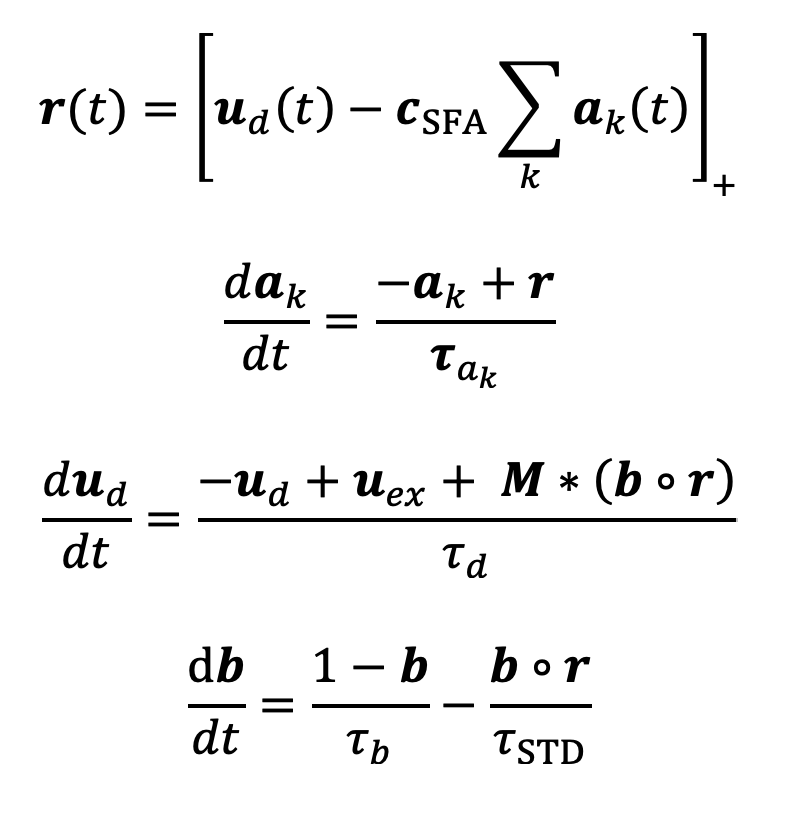

# StableRandomNonlinearNets

This is a theoretical neuroscience project investigating two forms of adaptation found in the brain: (1) weight adaptation and (2) bias adaptation. Mechanistically these most closely align with short-term synaptic depression and spike frequency adaptation, respectively. We model the effect of dual adaptation on continuous time recurrent neural networks.

## How to Run the code

### Setup
1.  Install the required Python packages:
    ```bash
    pip install numpy scipy matplotlib
    ```
2.  Install this project's package in editable mode from the root directory:
    ```bash
    pip install -e .
    ```

### Basic example
To run a basic example simulation, execute the following command from the root directory:
```bash
python examples/basic_example.py
```
This script will run a simulation, print the calculated Lyapunov exponent, and display plots of the results.

## Project Overview

Our neural network model includes:
- **Excitatory and inhibitory neurons** obeying Dale's principle
- **Rectifying (ReLU) neurons** with nonlinear dynamics
- **Adaptation only in excitatory neurons** - when there is high activity, weight and bias adaptation reduce the output of the E neurons, allowing the I neurons to "win" (i.e., dynamically balance the E neurons)

## Model Equations



The model consists of **n neurons** with the following variable dimensions:
- **r**, **u_d**, **u_ex**, and **p** are **n × 1 vectors**
- **M** is an **n × n** connectivity matrix
- Each neuron has **k** adaptation state variables **a_k** 
- Each neuron has **m** bias adaptation state variables **b_m**
- Each neuron has **one dendrite state variable u_d**
- The **total state size** is therefore **n × k + n × m + n × 1**
- **r** and **p** are derived quantities from the state variables
- **c_SFA**, **τ_d**, and **τ_STD** are constants

## Abstract

The brain is a highly recurrent neural network (RNN) that must remain dynamically stable, but near the edge of chaos. However, the dynamical stability of large continuous RNNs is tenuous, because the probability of unstable modes increases dramatically as network size and connectivity grows (May, 1972).  Intuitively, positive feedback loops within the brain have the potential to cause runaway re-excitation, leading to chaos. However, overly chaotic systems, as well as overly stable systems, underperform those on the edge of chaos (Langton, 1990). Moreover, the stability of linear dynamical systems depends entirely on connectivity (Lyapunov, 1892), so we might expect that learning rules must ensure dynamical stability. However, the brain is highly nonlinear and adaptive due to rectification, short-term synaptic depression (STD), and spike frequency adaptation (SFA).  We hypothesized that STD and SFA, which dynamically adapt connection weights and biases, respectively, will improve the stability of RNNs.  We investigated the scenario in which connectivity is random, sparse, and unbalanced. We found that (1) STD and SFA stabilize a wide range of RNNs, (2) STD and SFA keep these networks near the edge of chaos, depending on the longest timescale of adaptation, and (3) external stimulation engages STD and SFA to suppress hyperexcitability.

In conclusion, dynamic adaptation of both weights and biases via STD and SFA renders a wide range of networks stable and near the edge of chaos without any tuning of synaptic weights. Therefore, adaptation may be as important as connectivity with respect to stability, and learning rules need not ensure dynamical stability over the short term.  Further, we propose that stimulation may improve stability by engaging adaptation rather than simply inducing recurrent inhibition. Together, STD and SFA may be sufficient to stabilize the brain onto the edge of chaos.

## License

MIT License
